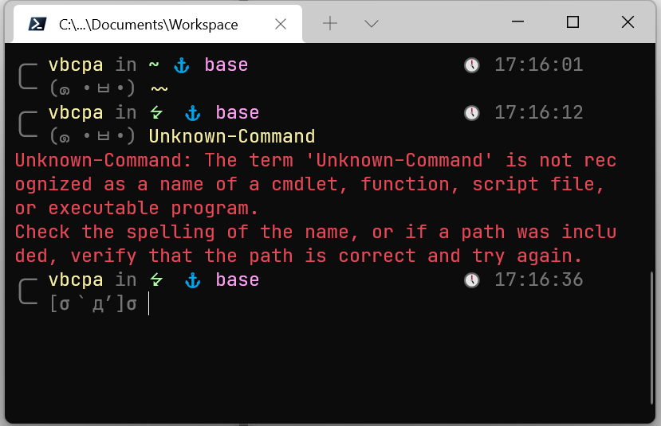

**本配置文件基于 PowerShell 7.1 及 Windows Terminal**

**These configuration files are based on PowerShell 7.1 and Windows Terminal**



## Install PowerShell Core

Documentation: [Installing PowerShell on Windows - PowerShell | Microsoft Docs](https://docs.microsoft.com/en-us/powershell/scripting/install/installing-powershell-core-on-windows?view=powershell-7.1)

GitHub: [Releases · PowerShell/PowerShell (github.com)](https://github.com/PowerShell/PowerShell/releases)


## Set up Powerline

Documentation: [Windows Terminal Powerline Setup | Microsoft Docs](https://docs.microsoft.com/en-us/windows/terminal/tutorials/powerline-setup)

1. Install Git

2. Install Posh-Git and Oh-My-Posh

   ``` powershell
   Install-Module posh-git -Scope CurrentUser
   Install-Module oh-my-posh -Scope CurrentUser
   Install-Module -Name PSReadLine -Scope CurrentUser -Force -SkipPublisherCheck
   ```


## Import PowerShell theme

Download the theme file:

1. Create a folder *PoshThemes* in *~/Documents/PowerShell/*
2. Move *Vbcpascal.psm1* in it

Use it in your profile file:

1. `code $PROFILE` in PowerShell and replace it by *Microsoft.PowerShell_profile.ps1* 
2. **Set the workspace directory** in line 6 if you need it, or **delete** all the codes after line 5


## How to use it?

If you use `WorkspaceDir`, this profile will support the following functions:

- Prompt: use ⭍  instead of path in Workspace

- `Enter-Workspace`, `~~` : alias of `cd $WorkspaceDir`

- `Enter-Project <dir>` : alias of `cd $WorkspaceDir/<dir>`

